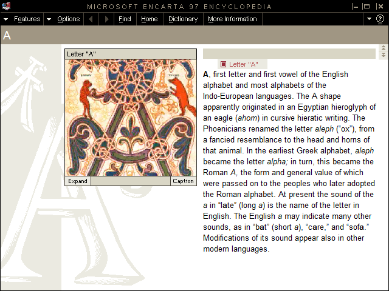
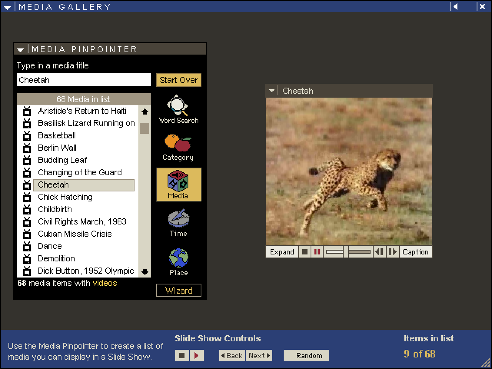
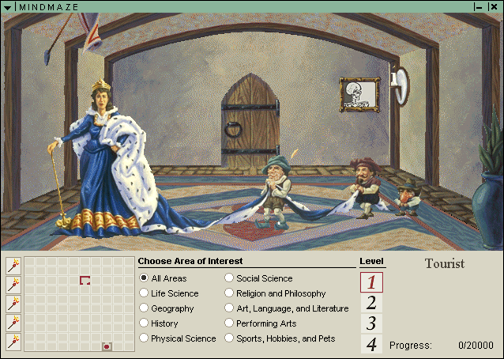
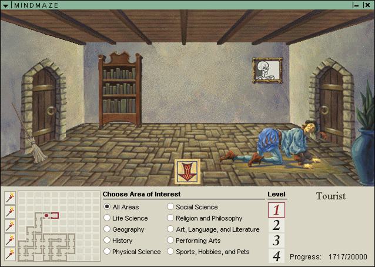
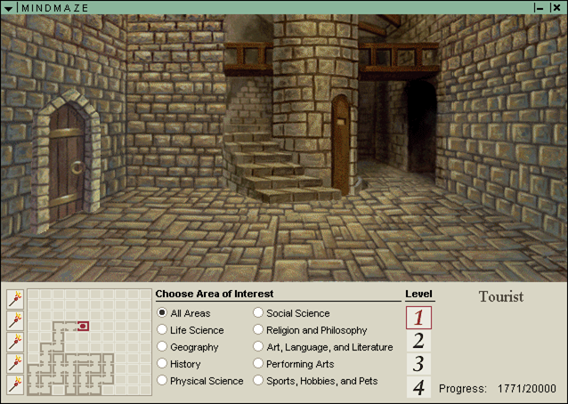

# Encarta 97 Encyclopedia - Static Recompilation Project

A project to statically recompile Microsoft Encarta 97 Encyclopedia (English, 2-CD edition) into modern, natively-running code for Windows 10/11+.

**It runs.** ENC97.EXE's 1.3 MB of x86 is mechanically translated to C, and the
recompiled code drives the real application on Windows 11 - CRT and MFC startup,
`InitInstance`, the app's `Run()` loop, the Encarta UI library, and article
rendering. Over one interactive session: **18,151,514 dispatched calls, 7,499,024
of them real MFC virtual dispatches landing in recompiled code** - ending in the
application's own clean `exit(0)`. Startup, a full session, and shutdown, all
driven by translated code.



Video works too - all 68 clips, decoded by the CD's own 16-bit Indeo driver
recompiled to C and handed back to Video for Windows:



It is not a static screenshot either - the encyclopedia is **navigable**. Below
is MindMaze, Encarta's trivia game, played from the recompiled binary:



It is playable to the end. Rooms render, the maze map fills in as you explore,
and scoring accumulates across the run:




### What works when you drive it

From an interactive session against the real CD:

| | |
|---|---|
| Article browsing, text, inline artwork | works |
| Search, Dictionary, the media archive | works |
| **Audio** - narration clips, background music, MindMaze effects | works |
| **MindMaze** - category select, levels, scoring, progression | works |
| Article pictures (SPAM media) | works - see note |
| **Video** - clips play in the Media Gallery | works - see below |

**Article pictures** initially failed with *"Encarta is not set up properly"*
(ENCTITLE.DLL string 25). Imagery comes through **SPAM**, Encarta's media
content system, and its interface DLL statically imports `AM16.DLL` /
`AMF16.DLL`. Despite the names those are **PE32, not 16-bit** - Setup copies
them to System32, so an uninstalled copy simply lacks them and ENCTITLE cannot
load at all. They ship on CD1 at `AAMSSTP\SYSTEM32\`; copy them beside
`ENC97.EXE` (the harness puts that directory on the DLL search path) and
pictures resolve.

**Video: the decoder is finished, playback is not wired up.** Those are two
different things and the table above means the second one.

All 68 clips are **Indeo 3.2** (`IV32`). Microsoft removed the Indeo codecs
from Windows years ago and the CD ships only the *16-bit* driver
(`AAMSSTP\SYSTEM16\IR32.DLL`), which a 32-bit process cannot load - so the
driver itself was statically recompiled, and it is exact: 68 of 68 first frames
decode to 100.00% identical pixels against FFmpeg, and the RGB frame
`ICM_DECOMPRESS` hands back matches at correlation 1.0000. You can decode any
clip on the disc today with `ir32_run`; see
[`tools/indeo`](tools/indeo/README.md).

**The join is built.** Encarta plays video through MCI - `ENC97.EXE` references
`.AVI`, `AVIVideo` and `mciSend`, `ENCTITLE.DLL` references `MSVFW` too - so
MCIAVI runs in the app's own process and asks Video for Windows for an `IV32`
decompressor. `ir32vfw.dll` registers the recompiled codec with `ICInstall`, and
the harness reports at startup:

```
video: IV32 registered (H:\AAMSSTP\SYSTEM16\IR32.DLL); ICLocate finds it
```

68 of 68 clips decode through that path, pixel-identical to driving the codec
directly. Nothing is hooked and the app is not modified.

**Clips play.** Driven interactively, the Media Gallery lists all 68 videos and
plays them - decoded frame, transport controls, the lot.


Every pixel of that cheetah came out of a 16-bit driver Windows cannot load,
translated to C and called back through Video for Windows. Nothing else on the
machine could have done it: `Drivers32` registers cvid, iyuv, mrle, msvc,
msyuv and tsbyuv, and no Indeo at all, so the only `IV32` handler in that
process is the recompiled one.

Timing has room to spare. The clips are 10 fps and the codec decodes at 59 fps
(17 ms a frame against a 100 ms budget), so it is not what would drop a frame.
Audio is a separate stream that MCIAVI plays itself and the video codec never
touches.

## Why?

Encarta 97 was a landmark multimedia encyclopedia — the gold standard of digital reference before Wikipedia. It shipped as a Win32 application targeting Windows 95/NT, built with MFC 4.0 and MSVC 4.x. On modern Windows 11 it barely runs due to:

- 16-bit thunking code (`ENCBOOT.EXE`, `ENC16.DLL`, `MMPLAYER.EXE` are NE/Win16)
- Removed WinG/Win32s compatibility layers
- Deprecated multimedia APIs (ACM streams, custom MCI drivers)
- Proprietary media container formats (`.M20`, `.FIF`/`.FTT`, `.MMM`)
- Palette-based 256-color display assumptions
- MSVCRT40.dll / MFC40.DLL dependencies

The goal is a clean, modern C/C++ codebase that runs natively and can serve as a reference implementation for the Encarta data formats.

## Binary Inventory

### Main Executable

| File | Type | Size | Code Size | Description |
|------|------|------|-----------|-------------|
| `ENC97.EXE` | PE32 i386 | 1,715,200 | 0x141000 (~1.3MB) | Main encyclopedia application |

- **ImageBase:** `0x00400000`
- **EntryPoint:** `0x0010DB70`
- **Subsystem:** Windows GUI (2)
- **Sections:** `.text` `.rdata` `.data` `.idata` `.rsrc` `.reloc`
- **Has relocations:** Yes (.reloc section present - good for static recomp)
- **Built with:** MSVC 4.x, MFC 4.0, targeting Win95/NT

### Companion DLLs (PE32)

| File | Size | Code Size | Exports | Role |
|------|------|-----------|---------|------|
| `ENCAPI32.DLL` | 14 KB | 0x1C00 | 30 | Encarta API — CD verification, article lookup, IPC |
| `ENCTITLE.DLL` | 355 KB | 0x45800 | 2 | Title/splash screen, SPAM (content container) interface |
| `DECO_32.DLL` | 134 KB | 0x1D000 | 28 | **FIF image decompressor** — proprietary image codec |
| `EEUIL10.DLL` | 526 KB | 0x45800 | 1,868 | Encarta UI Library — custom MFC widget framework |
| `ENCRES97.DLL` | 2,681 KB | — | 0 | Resource-only DLL (bitmaps, strings, dialogs) |

### Legacy 16-bit Components (NE format — will be replaced)

| File | Description |
|------|-------------|
| `ENCBOOT.EXE` | 16-bit bootstrap launcher |
| `MMPLAYER.EXE` | 16-bit multimedia player |
| `ENC16.DLL` | 16-bit helper / thunking layer |
| `MMX.DLL` | 16-bit multimedia extensions |
| `SETUP16.EXE` / `SETUP32.EXE` | Installer (not needed) |

### System Dependencies

| DLL | Version | Functions Used |
|-----|---------|---------------|
| `MFC40.DLL` | 4.0 | 398 (by ordinal) |
| `MSVCRT40.dll` | 4.0 | 71 |
| `KERNEL32.dll` | — | 107 |
| `USER32.dll` | — | 119 |
| `GDI32.dll` | — | 79 |
| `WINMM.dll` | — | 13 |
| `ADVAPI32.dll` | — | 7 |
| `SHELL32.dll` | — | 3 |
| `comdlg32.dll` | — | 4 |
| `LZ32.dll` | — | 1 |

## Data File Formats

### Content Containers (on both CDs)

| File | Format | Description |
|------|--------|-------------|
| `ENCARTA.M20` | Multimedia Viewer 2.0 | Main encyclopedia content (articles, images) |
| `ATLAS.M20` | MVB 2.0 | World atlas / maps |
| `ANATOMY.M20` | MVB 2.0 | 3D anatomy viewer data |
| `AUDIO1.M20` / `AUDIO2.M20` | MVB 2.0 | Audio clips (CD1/CD2 split) |
| `DICT.M20` | MVB 2.0 | Dictionary |
| `TIMELINE.M20` | MVB 2.0 | Interactive timeline |
| `BIBLIO.M20` | MVB 2.0 | Bibliography |
| `CONSULT.M20` | MVB 2.0 | Research consultant |
| `HILITDLX.M20` | MVB 2.0 | Highlights/features |
| `PICON.M20` | MVB 2.0 | Picture icons/thumbnails |
| `TOPGAL.M20` | MVB 2.0 | Topic gallery |
| `MMBAG.M20` | MVB 2.0 | Multimedia bag |
| `IA1.M20` / `IA2.M20` | MVB 2.0 | Interactive activities |
| `MAXMED1.M20` / `MAXMED2.M20` | MVB 2.0 | Maximum media content |

### Supporting Data

| File | Description |
|------|-------------|
| `ENCARTA.FTI` / `PICON.FTI` | Full-text search index |
| `ENCART97.DAT` | Application configuration |
| `ENC97S.STR` / `ENC97F.STR` | String tables |
| `SEEALSO.DAT` | Cross-reference links |
| `TIMEDB.DAT` / `MTIMEDB.DAT` | Timeline database |
| `PORTIONS.DAT` | Content portions/segments |
| `TOURS.ETO` | Guided tours data |
| `DIET96.DAT` | (CD2) Nutrition database |
| `MINDMAZE.DB` / `MINDMAZE.IDX` | MindMaze trivia game database |
| `E97SPAM*.CMF/MDF/TDF` | SPAM multimedia format files |
| `ANIM.M14` | Animations (Viewer 1.4 format) |

### Multimedia Assets (loose files in `MM/`)

| Type | Format | Count |
|------|--------|-------|
| Videos | `.AVI` (Indeo/Cinepak) | ~85 per CD |
| Music | `.MID` (General MIDI) | ~180 |
| Audio | `.WAV` + `.MMM` pairs | ~50 per CD |

## Key Components to Reimplement

### 1. DECO_32.DLL — FIF Image Decompressor (Priority: HIGH)
Proprietary image format used throughout Encarta. 28 exported functions including:
- `OpenDecompressor` / `CloseDecompressor`
- `SetFIFBuffer` / `ClearFIFBuffer` / `SetFTTBuffer` / `ClearFTTBuffer`
- `DecompressToBuffer` / `DecompressToYUV`
- Resolution/format control (`Get/SetOutputResolution`, `Get/SetOutputFormat`)
- Color table management (`Get/SetOutputColorTable`, `GetFIFColorTable`)
- `GetPhysicalDimensions`, `GetDecoVersion`

### 2. EEUIL10.DLL — Encarta UI Library (Priority: HIGH)
Massive MFC-based custom widget library with 1,868 C++ class exports. Key classes:
- `CRefWnd` / `CRefFrameWnd` / `CRefDialog` — Custom window hierarchy
- `CRefInfo` / `CRefUIManager` — UI state management
- `CFlybar` / `CFlyout` — Custom flyout menus (signature Encarta UI)
- `CRefButton` / `CRefComboBox` / `CRefListBox` / `CRefEdit` — Skinned controls
- `CRefPalMgr` / `CRefFontMgr` / `CRefSoundMgr` — Resource managers
- `CRefPropertySheet` / `CRefPropertyPage` — Settings dialogs
- `CRefToolTipBase` / `CRefActiveToolTip` — Custom tooltips
- `CBrushCache` / `C256Bitmap` — GDI optimization
- `CResourceObject` — Resource loading abstraction

### 3. ENCAPI32.DLL — Encarta API (Priority: MEDIUM)
Small IPC/utility DLL. Key exports:
- CD verification: `fReadVolumeLabel`, `fVerifyEncartaCD`, `fIsEncartaCDPresent`
- Article navigation: `fGetArticleID`, `fGetMainTitle`, `fGetSectionTitle`
- Media lookup: `fGetMediaArticleID`, `fGetMediaTitle`, `fGetMediaClass`
- IPC: `hWndLaunch`, `hWndFindEncarta`, `vDispatchJump`
- ACM stream wrappers: `acmStreamOpen/Close/Convert/Prepare/Unprepare`

### 4. ENCTITLE.DLL — Title Screen / SPAM Interface (Priority: MEDIUM)
- `fGetSpamInterfaces` — Entry point into the SPAM content system
- `fCreateShortcut` — Desktop shortcut creation
- Imports `AM16.dll` and `AMF16.dll` (16-bit SPAM/Viewer thunks)

### 5. M20/MVB Content Parser (Priority: HIGH)
The `.M20` files are Microsoft Multimedia Viewer 2.0 containers — a successor to Windows Help (`.HLP`). Need to reverse engineer or find documentation for:
- Topic/article storage and retrieval
- Embedded image references (FIF format)
- Hotspot/hyperlink encoding
- Full-text index format (`.FTI`)

### 6. ENC97.EXE — Main Application (Priority: HIGHEST)
1.3MB of code. The main application orchestrating everything:
- Article browser and renderer
- Search engine (uses `.FTI` full-text index)
- Atlas/map viewer
- Timeline viewer
- MindMaze trivia game
- Multimedia playback (AVI, MIDI, WAV)
- Print support
- Copy/paste and "word processor export"
- Online update system (yearbook updates via `.YBK` files)

## Architecture Overview

```
┌──────────────────────────────────────────────┐
│                  ENC97.EXE                    │
│           (Main Application)                  │
│  ┌──────────┐ ┌──────────┐ ┌──────────┐     │
│  │ Article  │ │  Atlas   │ │MindMaze  │     │
│  │ Browser  │ │ Viewer   │ │  Game    │ ... │
│  └────┬─────┘ └────┬─────┘ └────┬─────┘     │
│       │             │            │            │
│  ┌────┴─────────────┴────────────┴───────┐   │
│  │         Content Engine (MVB 2.0)       │   │
│  └────┬───────────────────────┬──────────┘   │
├───────┼───────────────────────┼──────────────┤
│  ┌────┴─────┐           ┌────┴─────┐        │
│  │EEUIL10   │           │ DECO_32  │        │
│  │(UI Lib)  │           │(FIF Img) │        │
│  └──────────┘           └──────────┘        │
├──────────────────────────────────────────────┤
│  ENCAPI32    │  ENCTITLE   │  ENCRES97       │
│  (API/IPC)   │  (SPAM)     │  (Resources)    │
├──────────────────────────────────────────────┤
│  MFC40.DLL  │  MSVCRT40   │  Win32 APIs     │
└──────────────────────────────────────────────┘
         │              │
    ┌────┴──┐     ┌─────┴─────┐
    │ CD 1  │     │   CD 2    │
    │.M20   │     │  .M20     │
    │.AVI   │     │  .AVI     │
    │.MID   │     │  .MID     │
    └───────┘     └───────────┘
```

## Recompilation Strategy

### Phase 1: Foundation & Data Formats — ✅ substantially complete
- [x] Set up build system (CMake + MSVC, Win32 target)
- [x] Reverse engineer DECO_32.DLL (FTC/FIF image codec) — **fully statically
      recompiled to native C** (all 28 exports, 137-function closure; see below)
- [x] Reverse engineer M20/MVB 2.0 container format (`m20dump`: B-tree walk,
      leaf-page parse, extract; `.FSM` entries are uncompressed `FTC\0` images)
- [x] Write standalone content extraction tools (`m20dump`, `decooracle`, `recomp`)
- [x] End-to-end real-content pipeline: ISO → `m20dump -x` → decode real
      `PICON.M20` images to full-colour PNG
- [x] **Drop the runtime DLL dependency** — `recomp_decode_standalone`
      reconstructs the codec's data image from a generated blob; all 5 picons
      decode byte-exact with **no `DECO_32.DLL` file**
- [ ] Finish format docs; handle the `"FIFF"` FIF variant + non-full-res scaling

### Phase 2: UI Framework
- [ ] Map EEUIL10.DLL's 1,868 exports to class hierarchy
- [ ] Reimplement core widget classes using modern Win32/GDI
- [ ] Replace 256-color palette logic with 32-bit rendering
- [ ] Reimplement CRefUIManager and theming system

### Phase 3: Core Application — ✅ the app runs as recompiled code
The strategy here is **mechanical static recompilation** (x86→C), the same
approach proven on DECO_32, rather than hand-reimplementation:

**The lift**
- [x] Static disassembly + function map of ENC97.EXE (IDA Pro idalib, 7,326 fns)
- [x] **Whole binary lifts to compilable C** — all 7,326 functions, 0 unhandled
      opcodes (`enc97_full.c`, ~452k lines, compiles clean)
- [x] Dispatch table validated at scale — **818 functions differential-match the
      real originals**, byte-exact
- [x] **All 914 imports wire to real code** (MFC40/MSVCRT40 ship in SysWOW64; the
      "MFC40 wall" was a myth)
- [x] Position-dependent / SEH code: **`fs:` segment access**, and `.reloc`-driven
      relocation of both address **immediates** and **displacements inside memory
      operands** (`mov dl,[ecx+0x56d902]`)
- [x] Indirect `call` resolves its target **before** pushing the return address —
      a real `call [esp+0x18]` reads its target with the pre-push `esp`
      (12,703 call sites; this one cost a jump to address 0)

**The hybrid boundary**
- [x] **Bidirectional lifted↔real** — import trampoline (lifted→real) plus a
      real→lifted `__thiscall` trampoline, so real MFC virtual-dispatch lands in
      recompiled code; **10,432 function-pointer slots routed**
- [x] `_initterm` routed so 182 static initializers run lifted
- [x] Three correctness rules the boundary trampoline has to obey, each found the
      hard way: seed **`ebp`** (MSVC's frameless SEH/dtor funclets address the
      *caller's* frame), be **reentrant** (a nested call must not clobber the
      outer's saved `esp`), and capture **`edx`** (64-bit returns come back in
      `edx:eax`)

**Running the thing**
- [x] The app gets its own command line (the lifted CRT parses `_acmdln`, which
      is otherwise the *harness* process's)
- [x] `ENC97_PROFILE` answers the `97Options` profile lookups
      (`CodePath`/`DATPath`/`BookPath`) that Setup would have written — so with
      CD1 mounted the app finds its content **without installing anything**
- [x] **Encarta 97 runs**: toolbar, article text, and its illuminated-manuscript
      artwork decoded and drawn ([screenshot](docs/encarta97-running.png))
- [x] **Driven interactively** — article browsing, search, dictionary, the media
      archive, audio and MindMaze all work from recompiled code
- [x] **Indeo 3.2 decoder** — the 16-bit `IR32.DLL` driver statically
      recompiled and **byte-exact**: 68 of 68 first frames decode to 100.00%
      identical pixels against FFmpeg, and the RGB frame the codec itself
      returns matches at correlation 1.0000
      ([`tools/indeo`](tools/indeo/README.md))
- [x] **Video codec bridged to VFW** — `ir32vfw.dll` registers the
      recompiled decoder with `ICInstall`, and the ENC97 harness confirms VFW
      finds it in-process. 68 of 68 clips decode through `ICM`
- [x] **Clips play in the app** — the Media Gallery lists all 68 videos and
      plays them ([screenshot](docs/encarta97-video.png)); no other Indeo
      decoder exists on the machine, so those frames are the recompiled
      codec's. 10 fps content, 59 fps decode
- [x] SPAM media (article pictures) — `AM16.DLL`/`AMF16.DLL` beside the app
- [ ] Shrink the real-code surface: replace MFC40/EEUIL10 with native equivalents

**Debugging tools** (in `recomp_enc97_run`, see its header for the full list)
- `R2L_LO`/`R2L_HI` — bisect *which vtable slots are routed* to lifted code
- `LIFT_LO`/`LIFT_HI` — bisect *which functions run lifted* to pin a bad lift
- `R2L_PASSTHRU` / `R2L_STUB` / `R2L_REAL` — an isolation ladder that says
      whether a failure is in the lift, the slot rewrite, the calling convention,
      or the stack switch
- `MSGBOX_LOG`, `REG_LOG`, `WATCH=va,...`, `RUN_TRACE`, `R2L_HEAPCHECK`

See `tools/recomp/README.md` for the full ENC97 recompilation writeup.

### Phase 4: Multimedia & Polish
- [ ] Replace ACM stream wrappers with modern audio APIs
- [x] AVI playback — done, and not the way this line assumed: the CD's own
      16-bit Indeo driver was recompiled and handed back to Video for
      Windows, so no FFmpeg or reimplementation was needed
- [ ] MIDI playback
- [ ] Remove CD-check / volume label verification
- [ ] Support reading content from local directory (no CD needed)
- [ ] Testing and compatibility

## Building

```bash
# Configure (requires Visual Studio 2022, Win32 target)
cmake -B build -G "Visual Studio 17 2022" -A Win32

# Build all tools
cmake --build build --config Release

# Build a specific tool
cmake --build build --config Release --target ftcdecode
cmake --build build --config Release --target m20dump
```

### Tools

| Tool | Directory | Description | Status |
|------|-----------|-------------|--------|
| `recomp` | `tools/recomp/` | **Static recompilation of the DECO_32 FTC codec** (x86→C) | **Working — pixel-exact** ([details](tools/recomp/README.md)) |
| `decooracle` | `tools/decooracle/` | Faithful DECO_32.DLL bridge → full-colour FTC; ground-truth oracle | **Working — perfect colour** |
| `ftcdecode` | `tools/ftcdecode/` | Clean-room FTC/FTT/FIF image decoder | Working (FTC grayscale, FTT/FIF perfect) |
| `m20dump` | `tools/m20dump/` | M20/MVB 2.0 container extractor | Working |
| `mvbtext` | `tools/mvbtext/` | Encarta article title/text extractor (MVB 2.0) | Titles ✓; phrase encoding solved, article prose reads ([details](tools/mvbtext/README.md)) |
| `encextract` | `tools/encextract/` | End-to-end pipeline: disc → decoded image gallery + titles + HTML | Working ([details](tools/encextract/README.md)) |
| `strdump` | `tools/strdump/` | STR string table dumper | Working |
| `spamdump` | `tools/spamdump/` | SPAM multimedia format dumper | Working |
| `datdump` | `tools/datdump/` | DAT configuration dumper | Working |
| `indeodec` | `tools/indeo/` | Indeo 3 (IV32) demuxer, plus the recompiled 16-bit `IR32.DLL` codec and its NE runtime | **Byte-exact** — 68/68 frames 100.00%, and its RGB output matches, vs FFmpeg ([details](tools/indeo/README.md)) |
| `fifdecode` | `tools/fifdecode/` | Old DLL bridge (wrong export signatures) | Superseded by `decooracle` |

### Static Recompilation (`tools/recomp`)

**DECO_32.DLL — done.** The proprietary FTC image codec has been **fully
statically recompiled** — **all 28 exports** mechanically translated from x86
(incl. x87 FPU) to native C by a purpose-built lifter (`lift.py`, capstone-based),
a **137-function closure** with zero unhandled opcodes. Validated
**byte-identical** to the original DLL, with **no original code executed**. It now
also runs with **no `DECO_32.DLL` file at all** (`recomp_decode_standalone`
reconstructs the data image from a generated blob). See
[`tools/recomp/README.md`](tools/recomp/README.md).

**ENC97.EXE — the whole 1.3 MB MFC app lifts, and the recompiled entry boots it.**
All **7,326 functions** lift to compilable C (0 unhandled opcodes); the dispatch
table is validated at scale (**818 functions differential-match** the originals);
all **914 imports wire to real code** (MFC40/MSVCRT40 ship in SysWOW64). The
lifter gained `fs:`/SEH and `.reloc`-driven address-immediate relocation, so the
**lifted entry point boots the application** — CRT init → `AfxWinMain` →
`InitInstance` → clean `exit`, with `_initterm` routed so 182 static-initializers
run lifted. A **real→lifted `__thiscall` trampoline** (the inverse of the import
trampoline) lets real MFC virtual-dispatch into lifted code. With all 10,432
function-pointer slots routed, **the application runs** — 18,151,514 dispatched
calls in one session, 7,499,024 of them real MFC virtual dispatches landing in
recompiled code, ending in the app's own clean `exit(0)`.

ENCAPI32.DLL is also lifted and validated against the real Win32 boundary
(`fGetArticleID`).

Both FTC encoding modes found in real content decode correctly:

| Mode | Header bytes | Share of PICON | Result |
|------|--------------|----------------|--------|
| self-contained | `01 01 02 01` | ~29% | **pixel-exact** to the DLL |
| FTT-referenced | `04 03 04 01` | ~71% | **clean full colour** (recomp is *more correct* than the DLL bridge, which speckles chroma under standalone setup) |

How it was built: a faithful DLL-bridge **oracle** (`decooracle`) established
ground-truth output + CRC baselines and a per-function call **tracer**
(`decotrace`); the codec was then lifted leaf-up and differentially validated
against the oracle at every step (the VLC reader alone passed 3,000,000
fuzz trials with zero mismatches).

### Real-content image pipeline

```bash
# 1. mount an Encarta ISO  (PowerShell: Mount-DiskImage CD1ENC97ENC.iso)
# 2. extract raw images from a container (use -x; the FTC entries are NOT
#    LZ77-compressed, so -d would corrupt them)
m20dump -x "G:\ENCYC97\PICON.M20" -o out_dir
# 3. decode a real image to PNG (auto-loads any referenced FTT from the same dir)
recomp_decode out_dir\T000009D.FSM "" image.png
```

`PICON.M20` holds **11,348 FTC images** (`.FSM`) + 49 shared fractal transform
tables (`.FTT`); all decode to correct full colour through the recompiled codec.

### FTC Decoder (`ftcdecode`)

Clean-room image decoder for Encarta 97's FTC (Fractal Transform Codec), FTT (raw pixel), and FIF (container) formats. Auto-detects format by magic bytes.

```bash
# Decode FTC (fractal compressed) to grayscale BMP
ftcdecode input.ftc output.bmp

# Decode FTT (raw uncompressed) to BMP — perfect quality
ftcdecode input.ftt output.bmp

# Extract image from FIF container — scans for embedded FTT/FTC
ftcdecode input.fif output.bmp

# Show header info
ftcdecode -i input.ftc

# Decode with debug output
ftcdecode -d input.ftc output.bmp
```

**Decode pipeline status:**
- [x] FTC header + sub-header parsing (28 + 39 bytes)
- [x] Sub-header context/parameter extraction (small mode)
- [x] LSB-first bitstream reader
- [x] 3-pass block assignment (green/skip/blue/red states)
- [x] 24-bit block decoding (7 scale + 14 offset + 3 opcode)
- [x] 4×4 superblock scan order (padded grid)
- [x] 16-bit scale table computation (word0=6 divide-by-10 formula)
- [x] FTT raw decode — **perfect quality** grayscale output
- [x] FIF container decode — **perfect quality**, extracts embedded FTT/FTC sub-images
- [x] FTC flat-fill decode — **recognizable grayscale** for all test files
- [x] Chroma scale table (word0=8 divide-by-16, separate from luma word0=6)
- [x] **FTC full colour — SOLVED** (via `decooracle` and the `recomp` static
      recompilation; the clean-room `ftcdecode` chroma path is superseded by the
      recompiled codec)

## Tools Needed

- [Ghidra](https://ghidra-sre.org/) or IDA Pro — for disassembly of PE32 binaries
- [Resource Hacker](http://www.angusj.com/resourcehacker/) — for extracting resources from ENCRES97.DLL
- Visual Studio 2022 (MSVC) — for building tools (Win32 target)
- CMake 3.16+ — build system
- Python 3 + `pefile` + `capstone` — for PE analysis and the x86→C lifter
  (`tools/recomp/lift.py`)
- IDA Pro (idalib, headless) / Ghidra — function boundaries + decompilation

## Credits

The reverse engineering here stands on other people's published work:

- **Kostya Shishkov** and **Alyssa Milburn** — their documentation of the
  FVF/IFS fractal codec family is what made the clean-room FTC decoder
  (`tools/ftcdecode`) possible. The header layout was reverse engineered from
  `DECO_32.DLL`, but the fractal transform itself is their groundwork.
- **[capstone](https://www.capstone-engine.org/)** (BSD-3-Clause) and
  **[pefile](https://github.com/erocarrera/pefile)** (MIT) — the disassembly and
  PE parsing the lifter is built on. Used as libraries, not vendored.
- **Ghidra**, **IDA Pro** and **Resource Hacker** — function boundaries,
  decompilation and resource extraction.

`DECO_32.DLL` is a fractal image codec Microsoft licensed from **Iterated
Systems**. It is a subject of the work here, not a contributor to it.

Tools and techniques from this project are contributed back to
**[pcrecomp](https://github.com/sp00nznet/pcrecomp)** — in particular
`runtime/hybrid/` (the lifted↔real boundary) and `docs/HYBRID.md`.

## Legal

The project's own code is MIT licensed — see [LICENSE](LICENSE).

That licence covers the tools, the lifter, the runtime and the harness. It does
not cover Microsoft Encarta 97 Encyclopedia: **no original executables, DLLs,
fonts or content files are distributed here**, and you need a legitimate copy of
the product to use any of this. The build deliberately ignores `*.iso`,
`analysis/` and the 40 MB generated lift, all of which are derived from your own
copy.

For honesty's sake: a handful of small files *are* derived from the original
product and are excluded from the MIT grant — the decoder test vectors under
`fif_test/`, the oracle traces produced by running the original DLL, and the
screenshot above. They are kept because the decoders cannot be tested without
them. [LICENSE](LICENSE) lists them explicitly.

## Status

**Encarta 97 runs as recompiled code.** The DECO_32 image codec is fully
recompiled (byte-exact, no DLL needed), the whole of ENC97.EXE lifts and
executes, and the application starts and renders articles on Windows 11.
Next: driving the UI with the body lifted, and shrinking the remaining
real-code surface (MFC40, EEUIL10).

- [x] Identify all executables and DLLs (PE32 vs NE/16-bit)
- [x] Catalog PE sections, imports, exports for all 32-bit modules
- [x] Map data file formats and multimedia assets
- [x] Ghidra/IDA disassembly of DECO_32.DLL — all functions mapped
- [x] M20/MVB 2.0 container parser + extractor (`m20dump`)
- [x] FTT raw decoder + FIF container decoder — **perfect quality**
- [x] **FTC full-colour decode — SOLVED**; **DECO_32 statically recompiled**
      (all 28 exports, byte-exact, no original code executed, no DLL needed)
- [x] **ENC97.EXE lifts whole** (7,326 fns) and **the application runs** as
      recompiled code, hybrid against real MFC

## Roadmap

Where it stands: the application body is recompiled C; MFC40, MSVCRT40,
EEUIL10 and Windows itself are still real code underneath. That is a working
program, not yet a port. The distance between the two is the roadmap.

**1. Prove it, and stop it regressing.** The app boots to the article view —
that is one code path. Everything else (search, atlas, timeline, MindMaze,
media playback) is untested lifted code, and each will surface its own lift
bugs the way `sub_4BB6F0` did.
- [ ] Drive the UI and fix what falls out, using the `R2L_LO/HI` and
      `LIFT_LO/HI` bisects — they turn "it crashed 30,000 calls in" into a
      named function in ~14 runs
- [ ] A scripted regression run (window appears, N real→lifted calls, no
      faults) so a lifter change can't silently break the boot
- [ ] Raise differential validation past the current 818/7,326 functions

**2. Shrink the real-code surface.** This is the actual work of becoming a port,
in cost order:
- [ ] **Lift `EEUIL10.DLL`** (1,868 exports) — it is PE32, the same lifter
      applies, and it is *Encarta's own* UI library. The single biggest step
      toward the app being entirely our code
- [ ] `ENCTITLE.DLL` — blocked on its 16-bit `AM16`/`AMF16` thunks
- [ ] `MFC40.DLL` — 398 imports by ordinal. Keep it real (it works) or
      reimplement the used subset; a decision, not an obligation
- [ ] Drop the CD check and run from a local content directory

**3. The 1997 assumptions.** Palette-based 256-colour rendering, GDI, ACM audio,
Indeo/Cinepak AVI, MIDI. Replace with modern equivalents once the code above is
ours to change.

**4. Then the interesting question: 64-bit and non-Windows.** Today everything
is 32-bit because lifted registers hold real host pointers. Both need the same
thing — a memory model that isn't "the register is the address".

**Formats** — documented in **[docs/FORMATS.md](docs/FORMATS.md)**
- [x] M20/MVB 2.0 container, B-tree directory, internal file layout
- [x] **`|Phrases` phrase dictionary decoded** — 1,808 entries, byte-exact
      against the size its own header declares
- [x] `|TTLBTREE` titles (31,517), `.RLE` baggage (plain BMPs), FTC/FTT/FIF
- [x] **Topic entries are LZ77** — same encoder as `|Phrases`; `mvbtext prose`
      decompresses them and reads real article text out
- [x] **Phrase references decoded** — one byte for the 32 fragments
      (`0x80-0x9F`), two for the rest (`0xA0-0xBF`: index
      `((b & 0x0F) << 8) | next`, plus a space when `b & 0x10`). Frequency
      settled it: the commonest codes are `the`, `of `, `and`, `in ` in order.
      Article prose now reads as prose
- [ ] **Topic record structure** — `prose` runs the phrase decoder over the
      whole decompressed block, so the non-text regions come out as repeated
      fragments after the article body ends
- [ ] Clean-room regeneration of the codec's constant tables (drop DLL-data dep)
- [ ] `"FIFF"` FIF variant + non-full-resolution scaling paths
