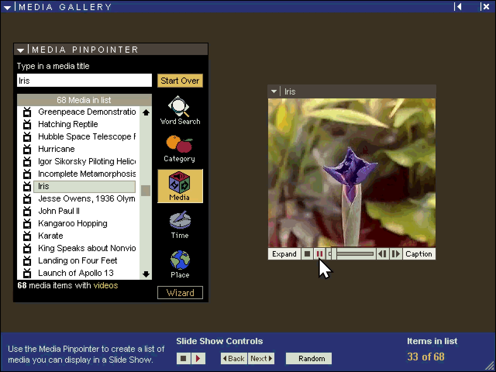

# Encarta 97 Encyclopedia — Static Recompilation Project

Statically recompiling Microsoft Encarta 97 Encyclopedia (English, 2-CD
edition) into native code that runs on Windows 10/11.

**It runs.** ENC97.EXE's 1.3 MB of x86 is mechanically translated to C, and the
recompiled code drives the real application on Windows 11 — CRT and MFC startup,
`InitInstance`, the app's `Run()` loop, the Encarta UI library, and article
rendering. Over one interactive session: **18,151,514 dispatched calls, 7,499,024
of them real MFC virtual dispatches landing in recompiled code** — ending in the
application's own clean `exit(0)`.


The encyclopedia is **navigable**, not a static screenshot. Below is MindMaze,
Encarta's trivia game, played from the recompiled binary — rooms render, the
maze map fills in as you explore, and scoring accumulates across the run:


**Video plays too.** All 68 clips, decoded by the CD's own 16-bit Indeo driver
recompiled to C and handed back to Video for Windows:



## What works

Driven interactively against the real disc:

| | |
|---|---|
| Article browsing, text, inline artwork | works |
| Search, Dictionary, the media archive | works |
| **Audio** — narration clips, background music, MindMaze effects | works |
| **MindMaze** — category select, levels, scoring, progression | works |
| **Article pictures** (SPAM media) | works — needs `AM16`/`AMF16`, see below |
| **Video** — clips play in the Media Gallery | works |
| Running with no disc in the machine | works — [`tools/localcontent`](tools/localcontent/README.md) |

**Article pictures** initially failed with *"Encarta is not set up properly"*
(ENCTITLE.DLL string 25). Imagery comes through **SPAM**, Encarta's media
content system, and its interface DLL statically imports `AM16.DLL` /
`AMF16.DLL`. Despite the names those are **PE32, not 16-bit** — Setup copies
them to System32, so an uninstalled copy simply lacks them and ENCTITLE cannot
load at all. They ship on CD1 at `AAMSSTP\SYSTEM32\`; copy them beside
`ENC97.EXE` (the harness puts that directory on the DLL search path) and
pictures resolve.

**Video** was the largest single obstacle and is worth stating in full. All 68
clips are **Indeo 3.2** (`IV32`). Microsoft removed the Indeo codecs from
Windows years ago and the CD ships only the *16-bit* driver
(`AAMSSTP\SYSTEM16\IR32.DLL`), which a 32-bit process cannot load. So the driver
itself was statically recompiled, and it is exact: **68 of 68 first frames
decode to 100.00% identical pixels** against FFmpeg, and the RGB frame
`ICM_DECOMPRESS` hands back matches at correlation 1.0000.

It is also wired up. Encarta plays video through MCI, so MCIAVI runs in the
app's own process and asks Video for Windows for an `IV32` decompressor.
`ir32vfw.dll` registers the recompiled codec with `ICInstall`:

```
video: IV32 registered (H:\AAMSSTP\SYSTEM16\IR32.DLL); ICLocate finds it
```

Nothing is hooked and the app is not modified. Every pixel came out of a 16-bit
driver Windows cannot load, translated to C and called back through Video for
Windows — and nothing else on the machine could have produced it, because
`Drivers32` registers cvid, iyuv, mrle, msvc, msyuv and tsbyuv, and no Indeo at
all. Timing has room to spare: the clips are 10 fps and the codec decodes at
59 fps (17 ms a frame against a 100 ms budget). Audio is a separate stream that
MCIAVI plays itself and the video codec never touches.

## Why?

Encarta 97 was a landmark multimedia encyclopedia — the gold standard of digital
reference before Wikipedia. It shipped as a Win32 application targeting Windows
95/NT, built with MFC 4.0 and MSVC 4.x. On modern Windows 11 it barely runs, due
to 16-bit thunking code (`ENCBOOT.EXE`, `ENC16.DLL`, `MMPLAYER.EXE` are
NE/Win16), removed WinG/Win32s compatibility layers, deprecated multimedia APIs
(ACM streams, custom MCI drivers), proprietary media containers (`.M20`,
`.FIF`/`.FTT`, `.MMM`), palette-based 256-colour display assumptions, and its
MSVCRT40/MFC40 dependencies.

The goal is a clean, modern C/C++ codebase that runs natively and can serve as a
reference implementation for the Encarta data formats.

## Building

Requires Visual Studio 2022 (Win32 target), CMake 3.16+, and Python 3 with
`pefile` and `capstone`.

```bash
cmake -B build -G "Visual Studio 17 2022" -A Win32
cmake --build build --config Release

# or one tool at a time
cmake --build build --config Release --target ftcdecode
```

You need a legitimate copy of the product — no original files are distributed
here. With CD1 mounted, `ENC97_PROFILE` answers the `97Options` profile lookups
(`CodePath`/`DATPath`/`BookPath`) that Setup would have written, so the app finds
its content **without installing anything**. To run without the disc, mirror it
once with [`tools/localcontent`](tools/localcontent/README.md).

Check everything still works with one command:

```bash
py tools/regress.py          # 9 checks, fast set ~4s; --full ~30s
```

A missing CD reports SKIP, never a pass.

## Tools

| Tool | Directory | Description | Status |
|------|-----------|-------------|--------|
| `recomp` | `tools/recomp/` | **Static recompilation** of DECO_32 and ENC97.EXE (x86→C) | **Working** ([details](tools/recomp/README.md)) |
| `indeodec` | `tools/indeo/` | Indeo 3 (IV32) demuxer, the recompiled 16-bit `IR32.DLL` codec and its NE runtime | **Byte-exact** — 68/68 frames vs FFmpeg ([details](tools/indeo/README.md)) |
| `localcontent` | `tools/localcontent/` | Mirror the CD and run from a hard disk, disc ejected | Working — 0 CD reads ([details](tools/localcontent/README.md)) |
| `mvbtext` | `tools/mvbtext/` | Article title/text extractor (MVB 2.0) | Titles ✓, prose reads ([details](tools/mvbtext/README.md)) |
| `encextract` | `tools/encextract/` | End-to-end: disc → image gallery + titles + HTML | Working ([details](tools/encextract/README.md)) |
| `m20dump` | `tools/m20dump/` | M20/MVB 2.0 container extractor | Working |
| `decooracle` | `tools/decooracle/` | Faithful DECO_32.DLL bridge; ground-truth oracle | Working |
| `ftcdecode` | `tools/ftcdecode/` | Clean-room FTC/FTT/FIF image decoder | Working ([details](tools/ftcdecode/README.md)) |
| `regress` | `tools/regress.py` | One command that re-checks everything that works | 9 checks |
| `strdump` / `spamdump` / `datdump` | `tools/` | STR, SPAM and DAT dumpers | Working |
| `fifdecode` | `tools/fifdecode/` | Old DLL bridge (wrong export signatures) | Superseded by `decooracle` |

## What has been recompiled

**DECO_32.DLL — done.** The proprietary FTC image codec is **fully statically
recompiled** — all **28 exports** mechanically translated from x86 (incl. x87
FPU) to native C by a purpose-built lifter, a **137-function closure** with zero
unhandled opcodes. Validated **byte-identical** to the original DLL, with **no
original code executed**, and it now runs with **no `DECO_32.DLL` file at all**.

**ENC97.EXE — the whole 1.3 MB MFC app lifts, and the recompiled entry boots
it.** All **7,326 functions** lift to compilable C (0 unhandled opcodes); **974
functions differential-match** the real originals byte-exactly; all **914
imports wire to real code** (MFC40/MSVCRT40 ship in SysWOW64 — the "MFC40 wall"
was a myth). A **real→lifted `__thiscall` trampoline** lets real MFC
virtual-dispatch land in lifted code, with **10,432 function-pointer slots
routed** and `_initterm` routed so 182 static initializers run lifted.

**IR32.DLL — done**, 16-bit NE and byte-exact; see the video section above.

**ENCAPI32.DLL** is also lifted and validated against the real Win32 boundary
(`fGetArticleID`).

The full writeups are in [`tools/recomp/README.md`](tools/recomp/README.md) and
[`tools/indeo/README.md`](tools/indeo/README.md).

### Real-content image pipeline

```bash
# 1. mount an Encarta ISO  (PowerShell: Mount-DiskImage CD1ENC97ENC.iso)
# 2. extract raw images from a container (use -x; the FTC entries are NOT
#    LZ77-compressed, so -d would corrupt them)
m20dump -x "G:\ENCYC97\PICON.M20" -o out_dir
# 3. decode a real image to PNG (auto-loads any referenced FTT from the same dir)
recomp_decode out_dir\T000009D.FSM "" image.png
```

`PICON.M20` holds **11,348 FTC images** (`.FSM`) + 49 shared fractal transform
tables (`.FTT`); all decode to correct full colour through the recompiled codec.

## Documentation

| | |
|---|---|
| [docs/ROADMAP.md](docs/ROADMAP.md) | Where this stands, what is planned, in what order |
| [docs/FORMATS.md](docs/FORMATS.md) | How the file formats are laid out — M20/MVB, `\|Phrases`, topic entries, FTC/FTT/FIF |
| [docs/INVENTORY.md](docs/INVENTORY.md) | What is on the discs: every binary and data file, and the architecture |
| [tools/recomp/README.md](tools/recomp/README.md) | The x86→C lifter, the hybrid boundary, and how it was validated |
| [tools/indeo/README.md](tools/indeo/README.md) | Recompiling a 16-bit NE video codec, start to finish |

## Credits

The reverse engineering here stands on other people's published work:

- **Kostya Shishkov** and **Alyssa Milburn** — their documentation of the
  FVF/IFS fractal codec family is what made the clean-room FTC decoder
  (`tools/ftcdecode`) possible. The header layout was reverse engineered from
  `DECO_32.DLL`, but the fractal transform itself is their groundwork.
- **[capstone](https://www.capstone-engine.org/)** (BSD-3-Clause) and
  **[pefile](https://github.com/erocarrera/pefile)** (MIT) — the disassembly and
  PE parsing the lifter is built on. Used as libraries, not vendored.
- **Ghidra**, **IDA Pro** and **Resource Hacker** — function boundaries,
  decompilation and resource extraction.

`DECO_32.DLL` is a fractal image codec Microsoft licensed from **Iterated
Systems**. It is a subject of the work here, not a contributor to it.

Tools and techniques from this project are contributed back to
**[pcrecomp](https://github.com/sp00nznet/pcrecomp)** — in particular
`runtime/hybrid/` (the lifted↔real boundary) and `docs/HYBRID.md`.

## Legal

The project's own code is MIT licensed — see [LICENSE](LICENSE).

That licence covers the tools, the lifter, the runtime and the harness. It does
not cover Microsoft Encarta 97 Encyclopedia: **no original executables, DLLs,
fonts or content files are distributed here**, and you need a legitimate copy of
the product to use any of this. The build deliberately ignores `*.iso`,
`analysis/` and the 40 MB generated lift, all of which are derived from your own
copy.

For honesty's sake: a handful of small files *are* derived from the original
product and are excluded from the MIT grant — the decoder test vectors under
`fif_test/`, the oracle traces produced by running the original DLL, and the
screenshots above. They are kept because the decoders cannot be tested without
them. [LICENSE](LICENSE) lists them explicitly.
